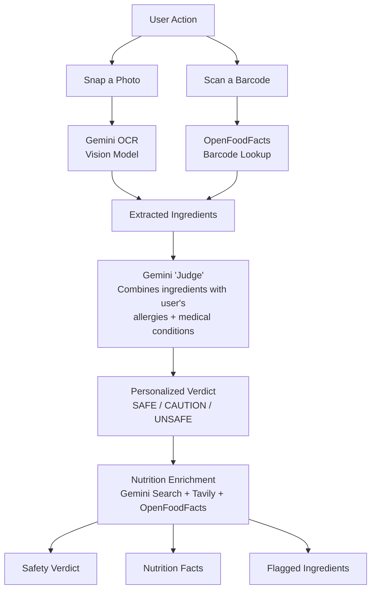

# 🥗 NutriScan — AI-Powered Health Assistant


> **NutriScan** is an **AI-powered food-safety & nutrition scanner**. Snap a photo of a product — or scan its barcode — and NutriScan extracts the ingredients, cross-checks them against **your allergies and medical conditions**, and returns a **personalized safety verdict** — building a clean, event-driven, role-secured Spring Boot platform on a modern micro-services-style infrastructure.

---

## 📌 Table of Contents

- [Overview](#overview)
- [Features](#features)
- [AI Food-Safety Pipeline](#ai-food-safety-pipeline)
- [System Architecture](#system-architecture)
- [Project Structure](#project-structure)
- [Technology Stack](#technology-stack)
- [Event-Driven Programming (RabbitMQ)](#event-driven-programming-rabbitmq)
- [Caching (Redis + Spring Cache)](#caching-redis--spring-cache)
- [Search & Observability (Elasticsearch + Kibana)](#search--observability-elasticsearch--kibana)
- [Authentication & Authorization (Keycloak)](#authentication--authorization-keycloak)
- [API Reference](#api-reference)
- [Run the Application](#run-the-application)
- [Deployment (Railway)](#deployment-railway)
- [CI/CD Pipeline (GitHub Actions)](#cicd-pipeline-github-actions)
- [Testing & Code Coverage](#testing--code-coverage)
- [Team Members](#team-members)

---

## Overview

**NutriScan** lets users discover exactly what is in the food they eat and whether it is safe *for them specifically*.

1. **Scan by image** — a photo of a product label or meal is analyzed with a vision-capable LLM (**Gemini OCR**).
2. **Scan by barcode** — the product is looked up in the **OpenFoodFacts** open dataset.
3. **AI safety judgment** — a "judge" LLM combines the extracted ingredients with the **user's stored allergies and medical conditions** to produce a **personalized verdict** (Safe / Caution / Unsafe) with reasons and flagged ingredients.
4. **Enrichment** — nutrition facts are gathered from OpenFoodFacts and **Tavily web search**, with results cached for speed.

Beyond scanning, NutriScan tracks **daily meals & nutrition**, manages **family members**, and keeps every scan **searchable** in Elasticsearch with **autocomplete suggestions**.

### Built for scale, correctness & resilience
- **Keycloak 26.6** as the OAuth2 / OIDC identity provider, extended with a **custom email-HTTP SPI** (Resend SMTP) and a **branded email theme**.
- **RabbitMQ** decouples scan indexing, deletion and user deletion into durable, retrying queues with **DLX/DLQ**.
- **Elasticsearch + Kibana** provide full-text search and observability, with a **PostgreSQL fallback** if ES is unavailable.
- **Redis + Spring Cache** cache AI results so repeat scans don't burn API tokens.
- **Railway** deployment with a custom domain and GitHub Actions CI.

---

## Features

- 🔍 **Image scanning (OCR)** — snap a product label, get its ingredients extracted by a Gemini vision model.
- 🏷️ **Barcode scanning** — resolve a barcode against the **OpenFoodFacts** dataset.
- 🛡️ **Personalized food-safety verdicts** — ingredients checked against the user's **allergies & medical conditions** (Safe / Caution / Unsafe, with flagged ingredients and reasons).
- 🍽️ **Meal analysis** — a meal photo is decomposed into ingredients and safety-checked.
- 📊 **Nutrition facts** — enrichment from OpenFoodFacts and **Tavily** web search.
- 📅 **Daily tracking** — meals, per-meal quantities and aggregated nutrition per day.
- 👨‍👩‍👦 **Family members** — independent allergy/condition profiles for the whole household.
- 🔎 **Elasticsearch search** — full-text search across scans with filters (verdict, status, date) and **autocomplete suggestions**.
- 🔔 **Real-time notifications** — scan status updates pushed over **WebSocket**.
- 🔐 **Authentication & roles** — Keycloak-managed JWT, OAuth2 resource server, custom registration & verification flow.
- 🖼️ **Cloudinary media** — profile & family-member picture upload.
- ⏲️ **Account lifecycle** — soft-delete with a 15-day grace period and restore.
- 🧹 **Operational tooling** — admin reindex endpoint + reconciliation scheduler; scheduled user reconciliation & account deletion.

---

## AI Food-Safety Pipeline



### How it works
1. **OCR / barcode extraction** — a dedicated **Gemini** model reads the label image, or the barcode is matched via OpenFoodFacts.
2. **Safety judgment** — a **Gemini "judge"** prompt injects the user's allergies & conditions and returns a **structured JSON** answer (via JSON-schema prompting).
3. **Search enrichment** — a **Gemini "search"** model + **Tavily** tool fetch trustworthy nutrition facts.
4. **Caching** — every AI result is cached in **Redis**, keyed by ingredients/barcode + allergies + conditions.
5. **Result storage** — scores, verdicts and flagged ingredients are persisted and indexed into Elasticsearch.

### AI providers used
| Provider | Role | Model |
|----------|------|-------|
| **Google Gemini** (Spring AI) | OCR / search / judge | Gemini Flash (vision + text) |
| **AWS Bedrock** (Spring AI) | Alternative structured chat | Claude (Sonnet) |
| **OpenAI-compatible** | Alternative chat client | via opencode.ai |
| **Tavily** (tool) | Web search for nutrition facts | API |
| **OpenFoodFacts** | Global food-product dataset | REST API |

---

## System Architecture

```
      ┌────────────────┐     ┌────────────────────────────────────────────────────────────┐
      │   Clients      │     │                 Spring Boot API (:8080)                    │
      │  (Web / Mobile)│────▶│                                                            │
      └────────────────┘     │  ┌───────────┐ ┌─────────┐ ┌────────────┐ ┌──────────────┐ │
                             │  │Controllers│ │Services │ │Repositories│ │  WebSocket   │ │
                             │  └─────┬─────┘ └────┬────┘ └─────┬──────┘ └──────────────┘ │
                             │        │            │            │                         │
                             │   ┌────▼────────────▼────────────▼───────────────────────┐ │
                             │   │                AI Orchestration                      │ │
                             │   │  Gemini(OCR/Search/Judge)  +  Tavily  +  Bedrock     │ │
                             │   └──────────────────────────────────────────────────────┘ │
                             └──────┬───────────────┬───────────────┬───────────────┬─────┘
                                    │               │               │               │
                        ┌───────────▼───┐   ┌───────▼────────┐  ┌───▼──────────┐  ┌─▼──────────────┐
                        │  PostgreSQL   │   │  Elasticsearch │  │   Redis      │  │    RabbitMQ    │
                        │   (app + KC)  │   │   + Kibana     │  │  (cache)     │  │   (event bus)  │
                        └───────────────┘   └────────────────┘  └──────────────┘  └────────────────┘
                                    │                                                      
                                    ▼
                         ┌──────────────────┐
                         │  Keycloak 26.6   │  ← custom email-HTTP SPI + branded theme
                         │  (auth.nutriscan │
                         │       .dev)      │
                         └──────────────────┘
```

**Key architectural principles**
- **Layered architecture** — Controller → Service → Repository (DTO + Mapper separation).
- **Event-driven** — cross-cutting work (indexing, deletion) is decoupled through RabbitMQ.
- **Stateless API** — JWT/OAuth2 resource server, no HTTP sessions.
- **Cache-first AI** — Redis + Spring Cache shrink LLM cost & latency for repeated scans.
- **Fail-fast validation** — Jakarta Bean Validation on every request DTO.
- **Resilience** — DB fallback when Elasticsearch is down; DLQ/retry for failed events.

---

## Project Structure

```
NutriScan-AI/
│
├── docker-compose.yml                    # PostgreSQL, Keycloak, Redis, ES, Kibana, RabbitMQ, app
├── Dockerfile                            # Multi-stage build (Temurin 21 JRE)
├── pom.xml                               # Spring Boot 4.1.0, Java 21, Spring AI 2.0
├── .env.example                          # Template for all secrets/config
│
├── keycloak/
│   ├── Dockerfile                              # Custom Keycloak 26.6 image (loads theme + SPI)
│   ├── spi/keycloack-email-http-provider/      # Custom email-HTTP SPI (Resend)
│   │   └── src/main/java/gov/iti/jets/keycloak/email/
│   │       ├── HttpEmailSenderProvider.java
│   │       └── HttpEmailSenderProviderFactory.java
│   ├── realm-config/import/nutriscan-realm.json
│   └── themes/nutriscan/                 # Branded login + email templates (FreeMarker)
│       ├── login/*.ftl + css
│       └── email/html/*.ftl
│
├── .github/
│   └── workflows/ci.yml                  # Lint (Spotless) + Build jobs
│
└── src/
    ├── main/java/gov/iti/jets/NutriScan/
    │   ├── NutriScanApplication.java      # Spring Boot entry point
    │   │
    │   ├── config/                        # Security, WebSocket, Security (JWT), Redis, Rabbit, Cloudinary, AI (Gemini/Bedrock/OpenAI), Async, Swagger, Time, HTTP
    │   ├── controller/                    # 8 REST controllers
    │   ├── service/                       # 12 service classes (+ AI orchestrators)
    │   ├── repository/                    # JPA repositories + specifications
    │   ├── listener/                      # Scan status / search sync / event publisher listeners
    │   ├── scheduler/                     # Reconciliation, user & account-deletion schedulers
    │   ├── security/                      # JWT converter, WebSocket interceptor, deletion filter
    │   ├── mapper/                        # MapStruct mappers
    │   ├── model/                         # 16+ JPA entities & value objects
    │   ├── dto/                           # Request/Response DTOs
    │   ├── ai/                            # AI clients, JSON-schema definitions, Tavily tool
    │   ├── exception/                     # Global handler + custom exceptions
    │   └── util/                          # Prompts, cache keys, image validation
    │
    └── main/resources/
       ├── application.properties              # default (local, docker profile)
       ├── application-docker.properties       # internal docker-network overrides
       ├── application-production.properties   # Railway/Cloud overrides
       └── db/migration/                       # Flyway migrations
    
```

---

## Technology Stack

### Backend

| Category | Technology | Version | Purpose |
|----------|-----------|---------|---------|
| Language | Java | 21 (Temurin) | Core backend development |
| Framework | Spring Boot | 4.1.0 | Application framework |
| ORM | Hibernate / Spring Data JPA | - | Object-Relational Mapping |
| Migrations | Flyway | (Boot-managed) | Versioned DB schema migrations |
| Security | Spring Security + OAuth2 Resource Server | - | JWT validation, role-based access |
| IAM | Keycloak | 26.6 | OAuth2 / OIDC identity provider |
| Event Bus | RabbitMQ (AMQP) | 4 | Event-driven messaging, DLX/DLQ |
| Cache | Redis + Spring Cache | 7 | AI result caching, data caching |
| Search | Elasticsearch | 9.4.2 | Full-text scan search + autocomplete |
| Observability | Kibana | 9.1.4 | Dashboards over ES indices |
| AI / LLM | Spring AI | 2.0.0 | Gemini, Bedrock, OpenAI-compatible clients |
| Web Search | Tavily (tool) | API | Nutrition fact web search |
| Food Dataset | OpenFoodFacts | REST API | Barcode → product/ingredient lookup |
| Media | Cloudinary | 1.39.0 | Image upload & hosting |
| Real-time | Spring WebSocket (STOMP) | - | Scan status push notifications |
| API Docs | SpringDoc OpenAPI | 2.8.5 | Swagger UI / OpenAPI spec |
| Email | Resend (HTTP) via custom Keycloak SPI | - | Verification & password-reset emails |
| Parsing | Jsoup | 1.18.1 | HTML content handling |
| Mapping | MapStruct | 1.5.5 | Bean mapping |
| Boilerplate | Lombok | - | Reduces boilerplate |

### Infrastructure

| Component | Technology | Version | Purpose |
|-----------|-----------|---------|---------|
| App Database | PostgreSQL | 17 (Alpine) | Application relational data |
| IAM Database | PostgreSQL | 17 (Alpine) | Keycloak data |
| Search Engine | Elasticsearch | 9.4.2 | Product/scan indexing |
| Dashboards | Kibana | 9.1.4 | Search observability |
| Message Broker | RabbitMQ | 4 (management) | Event queues + DLQs |
| Cache Store | Redis | 7 (Alpine) | Spring Cache backend |
| Auth Server | Keycloak | 26.6 | Custom build (theme + SPI) |
| Reverse proxy / hosting | Railway | - | Managed deployment + custom DNS |

### Build & Deployment

| Tool | Purpose |
|------|---------|
| Build Tool | Maven (with wrapper) |
| Package Format | JAR (Spring Boot executable) |
| Formatting | Spotless Maven Plugin (Eclipse style) |
| CI | GitHub Actions (lint + build) |
| Hosting | Railway (`nutriscan.dev` + custom DNS) |
| IAM Hosting | Railway (`auth.nutriscan.dev` + custom DNS, SMTP via Resend) |

---

## Event-Driven Programming (RabbitMQ)

NutriScan decouples expensive/cross-cutting work from request handling using RabbitMQ, with **publisher-confirms** and **mandatory returns** for reliable delivery.

```
                    ┌────────────────────────────┐
                    │     scan.exchange (topic)  │
                    └──────┬──────┬──────┬───────┘
                           │      │      │
              ┌────────────▼─┐ ┌──▼───────▼────┐ ┌─────────▼──────────┐
              │ scan.index   │ │ scan.delete   │ │   user.delete      │
              │  queue       │ │  queue        │ │   queue            │
              └──────┬───────┘ └──────┬────────┘ └──────┬────────────┘
                     │                │                 │
              ┌──────▼────────┐ ┌──────▼────────┐ ┌──────▼────────────┐
              │scan.index.dlq │ │scan.delete.dlq│ │ user.delete.dlq   │
              └───────────────┘ └───────────────┘ └───────────────────┘
```

### Queue topology
| Queue | Routing key | Purpose | Dead-letter queue |
|-------|------------|---------|-------------------|
| `scan.index.queue` | `scan.index` | Elasticsearch indexing of a new scan | `scan.index.dlq` |
| `scan.index.retry.queue` | `scan.index.retry` | Retry after transient failures | — |
| `scan.delete.queue` | `scan.delete` | Remove scan from Elasticsearch / cleanup | `scan.delete.dlq` |
| `user.delete.queue` | `user.delete` | Cascade user data deletion on account delete | `user.delete.dlq` |

### Reliability guarantees
- **DLX/DLQ per queue** — failed messages are routed to a dead-letter queue for later inspection, never silently lost.
- **Retry queue** — transient failures go through a dedicated retry queue before final rejection.
- **Publisher confirms & returns** — the producer is notified when a message is confirmed or returned (routed nowhere), enabling compensating logic.
- **Exactly-once indexing intent** — events are published after the DB transaction commits (`@TransactionalEventListener`), keeping PostgreSQL and Elasticsearch consistent.

---

## Caching (Redis + Spring Cache)

NutriScan uses **Redis 7** as the Spring Cache backend. Expensive work — LLM inference, external API calls, and frequently read reference data — is memoized with `@Cacheable` so repeat requests resolve instantly and never hammer upstream systems. Each cache has its own TTL, configured in `RedisCacheConfig` (the default TTL is 15 days).

| Cache name | Key | TTL | What it caches |
|-----------|-----|-----|----------------|
| `aiJudge` | ingredients + allergies + conditions | 1 day | Personalized food-safety verdict |
| `aiBarcode` | barcode + allergies + conditions | 3 days | Barcode-derived safety verdict |
| `aiSearch` | product name | 2 days | Nutrition facts from Tavily/search |
| `openFoodFacts` | barcode | default (15 days) | OpenFoodFacts product lookup response (unless `null`) |
| `userAllergiesAndConditions` | user id | 24 hours | User's allergies & medical conditions |
| `userProfile` | user `sub` | 1 day | User profile data |
| `userSummary` | user `sub` | 1 day | User summary |
| `scans` | `scanId` + user `sub` | 1 day | Old scan results (not cached while still `PROCESSING`) |
| `allergies` | id / name / `all` | default (15 days) | Allergies reference data |
| `diseases` | id / name / `all` | default (15 days) | Diseases / medical conditions reference data |

Why it matters:
- Repeated scans of the same product with the same user profile return **instantly** without calling the LLM.
- Frequently read reference data (allergies, diseases, OpenFoodFacts, profiles, old scans) is served from Redis instead of the database or external APIs.
- **Key generation** is centralized in `CacheKeys` so cache keys stay stable across invocations.
- **Selective caching** — `aiSearch` skips caching "unknown"/blank product names, and `scans` only caches completed (non-`PROCESSING`) results, so users always see live progress.

---

## Search & Observability (Elasticsearch + Kibana)

### Elasticsearch search
- Full-text search across scans with filters on **verdict, scan status, and date**.
- **Fuzzy search** — typo-tolerant matching. Queries of **3+ characters** enable `fuzziness: AUTO`, so even misspelled product names (e.g. "choclete" → "chocolate") still match. Short queries (1–2 chars) are matched exactly to avoid noisy results.
- **Autocomplete suggestions** (`/api/v1/scans/suggestions`) using edge n-gram analyzers (`productName.suggest._2gram` / `_3gram`) plus boolean-prefix multi-match.
- **Indexing is event-driven** via RabbitMQ (see above) so the DB and index stay in sync.
- **PostgreSQL fallback** — if Elasticsearch is down, or returns no results yet, queries gracefully fall back to the database so the API never breaks.
- A **reconciliation scheduler** re-indexes any out-of-sync rows, and an **admin reindex** endpoint rebuilds the whole index on demand.

#### Search flow: Elasticsearch + RabbitMQ + PostgreSQL fallback

```
                ┌──────────────────────────────┐
                │   Scan created / updated /   │
                │   deleted                    │
                └──────────────┬───────────────┘
                               │ @TransactionalEventListener
                               │ (only after DB COMMIT succeeds)
                               ▼
                      ┌────────────────┐
                      │  ScanEventPublisher │
                      └───────┬────────┘
                              │ publish
                              ▼
                    ┌───────────────────────────┐
                    │ RabbitMQ  scan.exchange    │
                    └───────────┬───────────────┘
                                │ routing key
                 ┌──────────────┴───────────────┐
                 │                              │
      ┌──────────▼─────────┐        ┌───────────▼──────────┐
      │ scan.index.queue   │        │  scan.delete.queue   │
      │ (or retry queue)   │        └───────────┬──────────┘
      └──────────┬─────────┘                    │ delete doc
                 │ index/update doc             ▼
                 │                     ┌────────────────┐
                 │                     │  Elasticsearch  │
                 │                     │  scan index     │
                 │                     └───────┬────────┘
                 ▼                             │
          ┌──────────────┐                     │
          │  Elasticsearch│◀───────────────────┘  store
          │  (scans index)│
          └──────────────┘

   USER SEARCH REQUEST (query / verdict / status / date)
                          │
                          ▼
              ┌────────────────────┐
              │  any filters?      │──No──▶ PostgreSQL only (Specification)
              └─────────┬──────────┘
                        │ Yes
                        ▼
                 ┌───────────────┐   success (hits > 0)
                 │  ScanSearchService   │──────────────▶ fetch scan details from
                 │  query Elasticsearch │                 PostgreSQL by IDs,
                 │  (fuzzy match)      │                 preserve ES ordering
                 └───────┬───────────┘
                         │ Elasticsearch down
                         │ OR returns 0 results
                         ▼
            ┌─────────────────────────────┐
            │  FALLBACK → PostgreSQL       │
            │  searchUsingSpecification()  │  (JPA Criteria + Specification)
            └─────────────────────────────┘
```

### Kibana
- **Kibana 9.1.4** connects to Elasticsearch to visualize scan data, indices and search health — the platform's observability layer.

---

## Authentication & Authorization (Keycloak)

NutriScan uses **Keycloak 26.6** as its identity provider, deployed as a **custom image** on `https://auth.nutriscan.dev`.

```text
Client ──login──▶ Keycloak ──JWT──▶ Spring Boot Resource Server
                                        │
                                  validates JWT via
                                  Keycloak JWK set
                                        │
                                  extracts roles
                                        │
                                  provisions local user
                                        │
                                  authorizes endpoints
```

### Customization
- **Custom email-HTTP SPI** — a bespoke `EmailSenderProvider` that sends verification and password-reset emails through the **Resend HTTP API** instead of Keycloak's SMTP provider.
- **Branded theme** — a `nutriscan` theme with custom FreeMarker **login**, **error**, **password-reset** and **user-info** templates plus CSS, and branded **email templates**.
- **Realm** — `nutriscan` realm imported from `keycloak/realm-config/import/nutriscan-realm.json` (clients, roles, SMTP config).
- **Custom DNS** — Keycloak served behind `auth.nutriscan.dev`.

During Spring Boot startup, the app calls the **Keycloak Admin Client** (`keycloak-admin-client 26.0.8`) to ensure users exist locally, and a scheduled **user-reconciliation** keeps identities in sync.

---

## API Reference

Interactive docs are available at `/swagger-ui.html` when the app is running (`/v3/api-docs` for the OpenAPI spec).

### Public / Discovery endpoints

| Method | Path | Description |
|--------|------|-------------|
| GET | `/api/v1/allergies` | All allergies |
| GET | `/api/v1/allergies/{id}` | Allergy by id |
| GET | `/api/v1/diseases` | All diseases/conditions |
| GET | `/api/v1/diseases/{id}` | Disease by id |

### Authentication endpoints

| Method | Path | Description |
|--------|------|-------------|
| POST | `/api/v1/auth/register` | Register a new user (Keycloak + local provisioning) |
| POST | `/api/v1/auth/resend-verification` | Resend verification email |
| POST | `/api/v1/auth/forgot-password` | Send password-reset email |
| POST | `/api/v1/auth/login` | Login (Keycloak OAuth2) |

### User endpoints

| Method | Path | Description |
|--------|------|-------------|
| GET | `/api/v1/users/me` | Current user summary |
| GET | `/api/v1/users/profile` | Current user profile |
| PATCH | `/api/v1/users/profile` | Update profile |
| POST | `/api/v1/users/profile/image` | Upload profile picture |
| PATCH | `/api/v1/users/family-member/{id}/image` | Upload family-member picture |
| POST | `/api/v1/users/me/daily-streak` | Update daily streak |
| DELETE | `/api/v1/users/profile` | Schedule account deletion (grace period) |
| POST | `/api/v1/users/profile/restore` | Restore a soft-deleted account |

### Scan endpoints

| Method | Path | Description |
|--------|------|-------------|
| POST | `/api/v1/scans` | Scan a product image (OCR) — async, returns 202 |
| POST | `/api/v1/scans/barcode` | Scan a barcode (OpenFoodFacts) — 202 |
| GET | `/api/v1/scans` | Search scans (query, verdict, status, date, page) |
| GET | `/api/v1/scans/favorites` | Favorite scans |
| GET | `/api/v1/scans/{scanId}` | Scan result |
| PATCH | `/api/v1/scans/{scanId}` | Rename / favorite a scan |
| DELETE | `/api/v1/scans/{scanId}` | Delete a scan |
| GET | `/api/v1/scans/suggestions` | Autocomplete suggestions |

### Daily tracking endpoints

| Method | Path | Description |
|--------|------|-------------|
| GET | `/api/v1/daily-tracking/today` | Today's tracking |
| GET | `/api/v1/daily-tracking/{date}` | Tracking for a date |
| GET | `/api/v1/daily-tracking` | All tracking (paginated) |
| PATCH | `/api/v1/daily-tracking/{date}` | Update a day's tracking |
| POST | `/api/v1/daily-tracking/{date}/meals` | Add a meal to a day |
| PUT | `/api/v1/daily-tracking/{date}/meals/{scanId}` | Update a meal quantity |
| DELETE | `/api/v1/daily-tracking/{date}/meals/{scanId}` | Remove a meal |
| DELETE | `/api/v1/daily-tracking/{date}` | Delete a day's tracking |

### Admin endpoints

| Method | Path | Description |
|--------|------|-------------|
| POST | `/api/v1/admin/search/reindex` | Rebuild the full Elasticsearch index |

All scan/health data endpoints are secured with **OAuth2 / JWT** and role-based authorization enforced by `SecurityConfig`.

---

## Run the Application

### Prerequisites

- **JDK 21** (Temurin)
- **Maven 3.9+** (or the included `./mvnw`)
- **Docker & Docker Compose**
- API keys: **Gemini**, **Tavily**, **Cloudinary**, **Resend**, and optionally **Bedrock** / **opencode.ai**

### Step 1 — Configure environment

Copy `.env.example` to `.env` and fill in your secrets:

```properties
DB_URL=jdbc:postgresql://localhost:5432/nutri_scan
DB_USERNAME=admin
DB_PASSWORD=admin

KEYCLOAK_ADMIN_USERNAME=admin
KEYCLOAK_ADMIN_PASSWORD=admin
KEYCLOCK_SMTP_PASSWORD=secret

RESEND_API_KEY=re_...
OPENCODE_API_KEY=...

GEMINI_API_KEY_OCR=...
GEMINI_API_KEY_JUDGE=...
GEMINI_API_KEY_SEARCH=...

CLOUDINARY_CLOUD_NAME=...
CLOUDINARY_API_KEY=...
CLOUDINARY_API_SECRET=...

TAVILY_API_KEY=tvly-...

BEDROCK_API_KEY=...

RABBITMQ_USERNAME=guest
RABBITMQ_PASSWORD=guest
```

### Step 2 — Start the infrastructure + app with Docker Compose

```bash
docker compose up -d --build
```

This starts **PostgreSQL (app + Keycloak), Keycloak, Redis, Elasticsearch, Kibana, RabbitMQ**, and the **NutriScan** application itself — all with healthchecks and auto-restart.

### Step 3 — Verify & access

| Service | URL |
|---------|-----|
| **NutriScan API** | `http://localhost:8080` |
| **Swagger UI** | `http://localhost:8080/swagger-ui.html` |
| **OpenAPI Spec** | `http://localhost:8080/v3/api-docs` |
| **Keycloak** | `http://localhost:8081` |
| **Elasticsearch** | `http://localhost:9200` |
| **Kibana** | `http://localhost:5601` |
| **RabbitMQ Management** | `http://localhost:15672` |
| **App Health** | `http://localhost:8080/actuator/health` |

---

## Deployment (Railway)

NutriScan and its Keycloak IAM are deployed on **Railway**, each with a **custom DNS** record.

| Service | URL | Type |
|---------|-----|------|
| NutriScan application | **https://nutriscan.dev** | REST API (production profile) |
| Keycloak identity provider | **https://auth.nutriscan.dev** | OAuth2 / OIDC + custom SPI |

- **Production profile** (`application-production.properties`) points the JWT/issuer and JWK-set to `https://auth.nutriscan.dev/realms/nutriscan`.
- **Emailing** is handled through **Resend** (SMTP/HTTP) so transactional emails (verification, password reset) are delivered reliably.
- Managed infrastructure on Railway: PostgreSQL, Redis, Elasticsearch, RabbitMQ, and the app container.

> **Railway deployment**
>
> ⤵️ _Add your Railway deployment screenshot here._
>
> ```text
> [ SCREENSHOT: NutriScan Railway project / services dashboard ]
> ```

---

## CI/CD Pipeline (GitHub Actions)

Continuous integration runs via **`.github/workflows/ci.yml`** and is triggered on **push to any branch** and **pull requests to `main` / `develop`**. The pipeline contains **two jobs**:

| Job | Runs on | Steps |
|-----|---------|-------|
| **lint** | `ubuntu-latest` | `actions/checkout` → `setup-java` (Temurin 21, Maven cache) → `mvn spotless:check` (formatting validation) |
| **build** | `ubuntu-latest` (`needs: lint`) | `actions/checkout` → `setup-java` (Temurin 21, Maven cache) → `mvn clean package -DskipTests` |

The build job only runs **after** the lint job passes, ensuring only well-formatted, compiling code reaches later stages.

```yaml
# .github/workflows/ci.yml — summary
jobs:
  lint:   # Spotless formatting check
  build:  # mvn clean package (depends on lint)
```

---

## Testing & Code Coverage

- Backend tests use **Spring Boot Test, JUnit 5, and Mockito**.
- Test-scoped starters include `data-jpa-test`, `validation-test`, `webmvc-test`, and `spring-rabbit-test`.
- Base application context test: `src/test/java/gov/iti/jets/NutriScan/NutriScanApplicationTests.java`.
- The CI `build` job compiles and runs tests during `mvn clean package`.

---

## Team Members

| Name | Role |
|------|------|
| _— add team member —_ | Backend |
| _— add team member —_ | AI / Data |
| _— add team member —_ | DevOps |